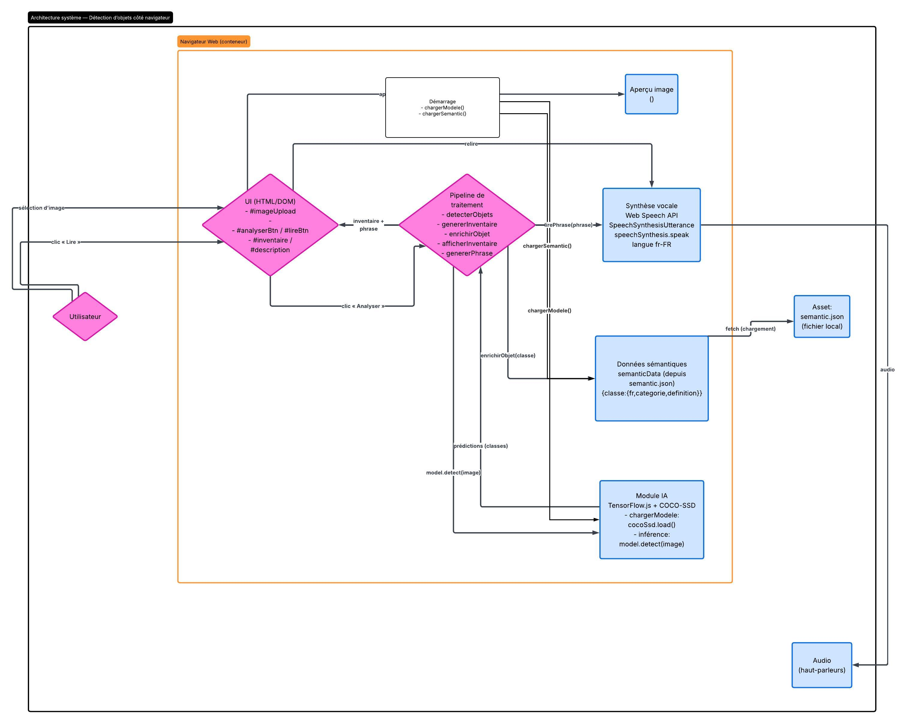

# GUIDE D'UTILISATION DE L'OUTIL DE DETECTION D'OBJETS DANS UNE IMAGE TELEVERSEE

> Ce guide est destiné à l'équipe IT.
> Il explique le fonctionnement de l'application en ligne de détection d'objets dans une image téléversée.

## Table des matières

1. [Architecture du projet](#architecture-du-projet)
2. [Structure des prédictions](#structure-des-predictions)
3. [Pipeline complet](#pipeline-complet)
4. [Gestion du JSON sémantique](#gestion-json)
5. [Pistes d'améliorations techniques](#pistes-ameliorations-techniques)

# Architecture du projet

Cette application est une petite application web <span title="qui ne s'exécute que dans le navigateur">locale</span> qui :

* Charge au démarrage un modèle de détection d’objets (TensorFlow.js COCO-SSD).
* Charge un fichier local semantic.json qui enrichit chaque classe détectée avec : une traduction française (fr), une catégorie (categorie) ainsi qu'une définition.
* Permet à l’utilisateur de sélectionner une <span title="via un champ de formulaire HTML">image</span>, l’affiche en aperçu dans une balise ```<canvas>```, puis l'utilisateur lance l’analyse via le bouton **Analyser**.
* Exécute la <span title="model.detect(image)">détection</span>
* Le modèle, pré-entraîné, de détection des objets fournit des prédictions sous forme d'une liste contenant un dictionnaire par objet détecté.
* Le script agrège ensuite les résultats en inventaire, enrichit chaque classe grâce au fichier JSON d'enrichissement sémantique 'semantic.json', puis affiche l’inventaire dans la page.
* Finalement, l'application génère une phrase de synthèse en français (ex. « J’ai détecté 2 personnes, 1 chien… »), l’affiche, et la lit à voix haute via l’API Web Speech (speechSynthesis).

## Flux d’architecture :

* **Interface utilisateur (UI) :** Téléversement image → aperçu
* **Chargements :** chargerModele() (COCO-SSD) + chargerSemantic() (fetch JSON)
* **Action :** clic Analyser → detecterObjets() → model.detect(image)
* **Traitement :** genererInventaire() → enrichirObjet() → genererPhrase()
* **Sorties :** afficherInventaire() + texte + lirePhrase() (synthèse vocale)

## Dépendances clés à l’exécution :

* COCO-SSD (chargement + inférence) dans le navigateur
* fetch("semantic.json") (asset statique)
* DOM + Web Speech API (langue fr-FR)

# Structure des prédictions

La variable _Predictions_ est un tableau qui contient chacun des objets détectés dans un dictionnaire :
>
>   ```Predictions: [
>           0:{
>               bbox: [4 valeurs de sommet de bounding box],
>               class: "objet détecté",
>               score: valeur réelle comprise entre 0 et 1
>           },
>           1:{
>               ...
>           }   
>       ]```


# Pipeline complet



# Gestion du fichier d'enrichissement sémantique

Le fichier JSON structuré de la manière suivante :
>```{
>   "dog": {                                                **-> On retrouve le champ "class" de nos dictionnaires d'objets détectés**
>       "fr": "chien",                                      **-> La traduction du champ "class" en français**
>       "categorie": "animal",                              **-> Une catégorie pour aider la synthèse vocale**
>       "definition": "Un chien est un animal domestique."  **-> La definition est une description qui est lue par le synthétiseur de voix**
>   },
>
>   "person": {
>       "fr": "personne",
>       "categorie": "être humain",
>       "definition": "Une personne est un être humain ."
>  },
> ...
>}```

# Pistes d'améliorations techniques

* Ajouter les boîtes de contourage sur les images grâce aux données de position des sommets stockées dans les prédictions.
* Permettre la détection d'objets via la webcam de votre ordinateur.
* Améliorer l'accessibilité de l'interface utilisateur
* Ajouter une fonctionnalité qui enregistre un historique des analyses
* Permettre à l'utilisateur d'exporter l'historique des analyses au format JSON
* Ajouter une fonctionnalité de lecture/écriture sur le disque dur local afin d'envisager un stockage des historiques et des fichiers d'enrichissement sémantique.
