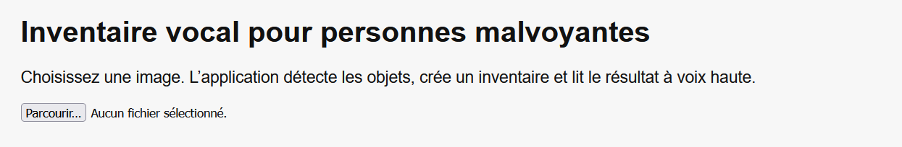
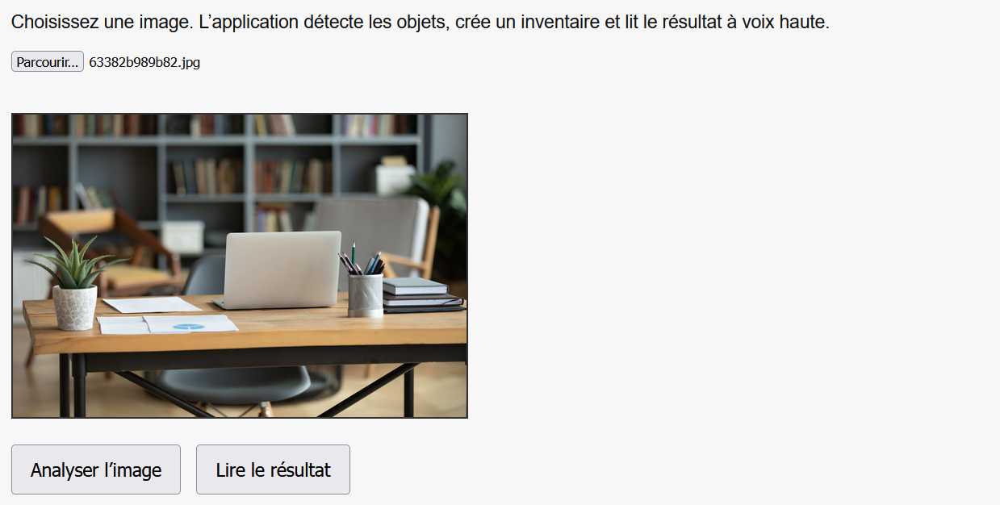
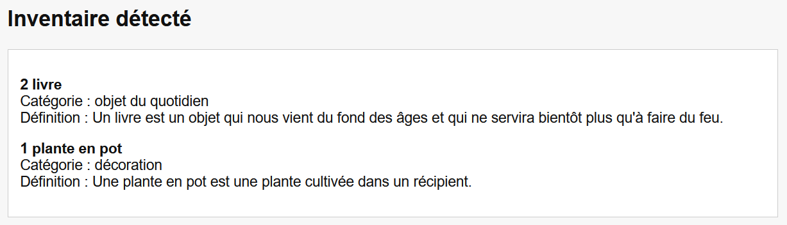
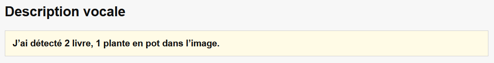

# GUIDE D'UTILISATION DE L'OUTIL DE DETECTION D'OBJETS DANS UNE IMAGE TELEVERSEE

> Ce guide est destiné à la direction, aux associations et aux métiers.
> Il explique l'utilisation de l'application en ligne de détection d'objets dans une image téléversée.

## Table des matières

[Etape 1](#etape1)
[Etape 2](#etape2)
[Etape 3](#etape3)
[Conclusion](#conclusion)

# Etape 1

Ici, il vous faudra insérer votre image depuis votre ordinateur. Une fois cela fait, vous verrez votre image apparaître sur la page comme l'exemple ci-dessous :

# Etape 2
Deux boutons à cliquer se présentent alors à vous :
* le premier, **"Analyser l'image"** permet de lancer la détection d'objets sur l'image que vous avez sélectionnée.
* le second, **"Lire le résultat"** permet de lancer la lecture de l'aide vocale qui décrit ce qui se trouve dans l'inventaire.

# Etape 3
Une fois le bouton **"Analyser l'image"** activé, le modèle d'IA pré-entraîné initie la détection des objets dans la photographie et en affiche un inventaire en dessous.

A la fin de la détection, la synthèse vocale indiquera à l'utilisateur ce que contient l'inventaire.

Cliquez sur le bouton **"Lire le résultat"** relancera la synthèse vocale qui lira la description ddes objets détectés sur l'image.

# Conclusion
Notre modèle détecte différents objets. Il permet d'enrichir l'inventaire à l'aide d'une base de données, un fichier JSON qui renvoie les informations à notre script JS. Cet outil peut donc être évolutif dans sa capacité à reconnaître et traduire en français les objets qu'il reconnait.